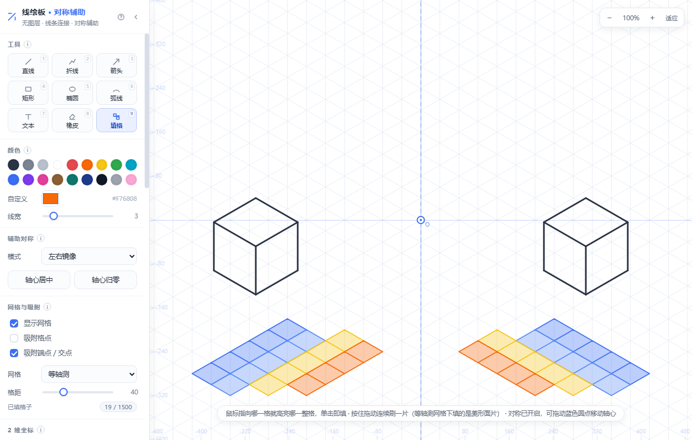
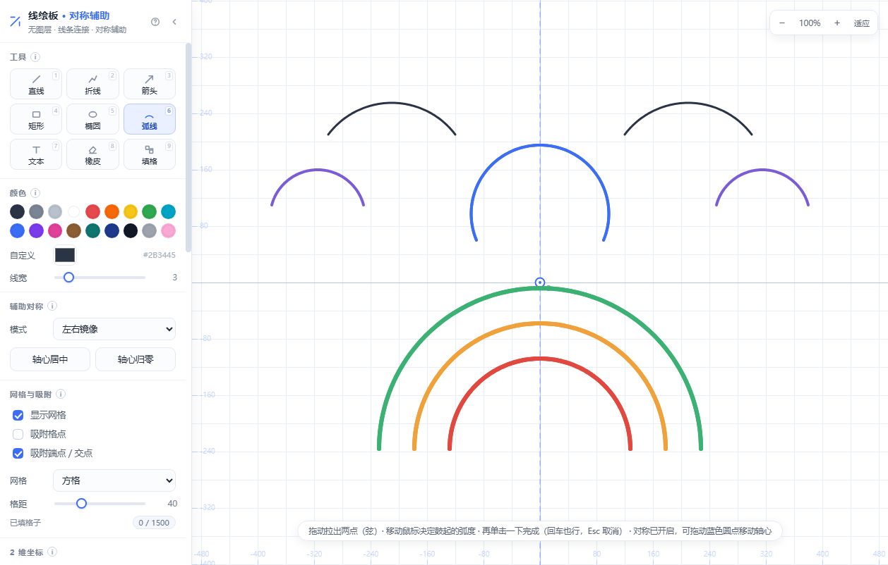

<div align="center">

# 线绘板 LineBoard

[](https://github.com/pierce0213/lineboard--/releases/tag/v1.0.0)
[](LICENSE)
[](symmetry-draw.html)
[](#-技术实现)

**无图层 · 纯线条 · 对称辅助的网页画板 —— 为不会画画的人做的绘图工具**

一个 HTML 文件，双击就能用。专为画正方体等立体图形设计的等轴测网格、
实时镜像对称、按格填色，还能接上大模型，一句话让它替你画在画布上。

[快速开始](#-快速开始) · [功能一览](#-功能一览) · [AI 生成](#-ai-生成一句话画出可编辑的画) · [快捷键](#-快捷键) · [常见问题](#-常见问题)



</div>

---

## 为什么做这个

会写代码的人很多，会画画的很少。想表达一个想法——一个房屋结构、一个立方体、
一张流程示意图——打开 Photoshop 是折磨，打开白板工具又画不齐、画不正。

线绘板的思路是：**把"画得正"这件事交给程序，人只负责决定画什么。**

- 没有"手抖"：端点自动吸附到格点和已有线条，画出来的立方体棱对棱、角对角
- 没有"画不对称"：打开镜像，画一半，另一半实时长出来
- 没有"结构画崩"：等轴测网格 + 按格填面，体块感是网格保证的
- 没有"画不出来"：接上大模型，一句话描述，它替你画——画出来的是**真正的线条图形**，
  不是一张不能改的图片

## ✨ 功能一览

| 功能 | 说明 |
| --- | --- |
| 🖊️ 9 种绘制工具 | 直线 / 折线 / 箭头 / 矩形 / 椭圆 / **弧线** / 文本 / 橡皮 / 填格，快捷键 1–9 |
| 🪞 辅助对称 | 左右镜像 / 上下镜像 / 四象限 / 中心对称 180° / 径向 N 等分（2–24），轴心可直接拖动；**实时派生**，关掉副本即消失 |
| 📐 等轴测网格 | 30° 三向格，专门用来画正方体等立体图形；斜棱偏移 = 纵向偏移 × 1.732，比例永远是对的 |
| 🟦 按格填色 | 鼠标指哪格亮哪格，单击填充、拖动连刷；等轴测下填的是菱形面片，天然带体块感 |
| 🧲 双重吸附 | 吸附到网格点（蓝点）或已有线条端点（红圈），接缝严丝合缝 |
| 📏 2 维坐标系 | 坐标轴 + 边缘标尺 + 原点 O + 光标实时坐标，y 轴向上/向下可切——讲题、出题都方便 |
| 🌊 弧线工具 | 拉出一条弦，移动鼠标定弧度，再点一下落笔；可画超过半圆的深弧 |
| 🤖 AI 生成 | 一句话（可附参考图）→ 大模型输出结构化绘图指令 → 直接画在画布上，**可继续编辑、可撤销、可对称** |
| 🖼️ 图片转线条 / 转填格 | 完全在本机完成（灰度 + Sobel 边缘 / 众数采样 + 颜色聚类），不联网、不需要密钥；转填格有**标准 52 / 高清 80 / 超清 110 / 原色 130 格**四档（原色档几乎不并色、颜色最贴原图），四周空白自动裁掉、背景自动剔除，长图不压扁，最大 16000 格 |
| 💾 自动保存 | 每 4 秒存到浏览器本地，刷新、误关页面都能恢复；作品可导出 `.json` 存档 |
| 📤 导出 | 2 倍分辨率白底 PNG |
| ⚡ 零依赖 | 单文件 HTML，无框架、无构建、无 npm install，离线可用（AI 联网除外） |

<p align="center"></p>

## 🚀 快速开始

**方式一：直接打开（推荐）**

下载 `symmetry-draw.html`，双击用浏览器打开。完事。

**方式二：本地起个服务**（可选，体验完全相同）

```bash
python -m http.server 8000
# 打开 http://localhost:8000/symmetry-draw.html
```

**方式三：部署成在线链接**

把仓库推到 GitHub 后开启 **GitHub Pages**（Settings → Pages → 选择 main 分支），
即可得到一个免费的公开访问链接，手机也能用。

> 上手 30 秒：点「示例」生成一个等轴测正方体 → 左侧「辅助对称」选「左右镜像」→
> 切到「填格」在地面上刷几格颜色 → 感受一下画一半出两个的效果。

## 🖥️ 跨平台与浏览器支持

**Windows / macOS / Linux 都能用，桌面和触屏都一样。** 这是一个纯前端单文件，
不装环境、不需要编译，「能不能跑」只取决于浏览器。

已验证：**12 个平台场景 × 2 套内核（Chrome、Edge），各 278 项断言全绿**，
另有 149 项功能回归测试全绿。详见 [docs/跨平台兼容性报告.md](docs/跨平台兼容性报告.md)。

| 环境 | 状态 | 说明 |
| --- | :---: | --- |
| Windows + Chrome / Edge | ✅ | 主力开发与测试环境 |
| macOS + Safari | ✅ | 快捷键提示自动显示 ⌘；Safari 会忽略一个降采样画质选项，不影响功能 |
| Linux + Chrome / Chromium / Edge | ✅ | 中文走 Noto Sans CJK |
| Linux + Firefox | ✅ | 已有独立的滑块与滚动条样式，不会退回系统默认外观 |
| Android / iPadOS 触屏 | ✅ | 已处理多指同时落笔与系统手势打断 |
| 双击 HTML 打开（`file://`） | ✅ | 自动存档在三大浏览器下均正常 |

已经抹平的平台差异：Mac 显示 `⌘` 而非 `Ctrl`；非 US 键盘布局（法语 AZERTY 等）
按物理数字键同样能切工具；手机竖屏上面板自动收成图标栏（画布占视口 86%，此前只剩 34%）。

## 🤖 AI 生成：一句话画出可编辑的画

左侧面板底部「AI 生成」里填入任意一家大模型的 API Key，然后在输入框里
写一句「画一个有门窗的小房子，红色屋顶」，模型就会把画面**真正画在画布上**。

关键设计：AI 输出的不是图片，而是一份**结构化绘图指令 JSON**（折线 / 文字 / 色块），
所以生成结果依然是一等公民——

- 可以用橡皮删掉某一笔、可以 Ctrl+Z 整批撤销
- 可以再开对称让它镜像复制、可以用填格工具往上补色
- 可以导出成 PNG，或者继续用一句话追加修改（「屋顶换成紫色」）

内置预设（也可填任意 OpenAI / Anthropic 兼容的中转地址）：

| 预设 | 能否看图 | 默认模型 |
| --- | :---: | --- |
| DeepSeek | — | deepseek-chat |
| 通义千问 · 百炼 | ✅ | qwen-vl-max-latest |
| 智谱 GLM | ✅ | glm-4v-plus |
| 硅基流动 | ✅ | Qwen2.5-VL-32B-Instruct |
| 月之暗面 Kimi | ✅ | moonshot-v1-8k-vision |
| OpenAI | ✅ | gpt-4o-mini |
| Anthropic Claude | ✅ | claude-3-5-sonnet |

**隐私**：API Key 只保存在你自己浏览器的 localStorage 里，请求由浏览器直接发给你
填写的接口地址，不经过任何第三方服务器。若某天不再使用，清除浏览器数据即可。

> **提示**：少数接口不允许浏览器跨域直连（CORS），点「测试连接」若报跨域错误，
> 换用支持 CORS 的服务商或自建中转即可——面板会把原始错误信息完整显示出来。

## ⌨️ 快捷键

| 按键 | 作用 |
| --- | --- |
| `1` – `9` | 切换工具：直线 / 折线 / 箭头 / 矩形 / 椭圆 / 弧线 / 文本 / 橡皮 / 填格 |
| `空格` + 拖动 | 平移画布 |
| 滚轮 | 缩放画布 |
| `Ctrl+Z` / `Ctrl+Shift+Z`（macOS 为 `⌘Z` / `⇧⌘Z`） | 撤销 / 重做 |
| `Enter` | 结束折线 / 确认弧线 |
| `Esc` | 取消当前绘制 |

把鼠标停在任意按钮上会弹出用法气泡，所有功能说明都收在那里，界面保持干净。

## 🧱 技术实现

单文件 HTML + Canvas 2D + 原生 JavaScript，约 4000 行，无任何依赖。

几个值得一提的设计：

- **对称是渲染期派生的，不写进数据。** 画布上只存你亲手画的那一份，镜像/旋转副本
  在每一帧实时算出来。所以关掉对称，副本干净消失；改一笔，所有副本同步更新。
- **弧线落笔即普通折线。** 「弦 + 弓高」在落笔那一刻就换算成折线点集（端点精确
  落在弦两端），之后撤销、吸附、橡皮、导出、AI 全部零改动自动兼容。
- **世界坐标 / 屏幕坐标分离。** 图形存世界坐标，缩放平移只改一个变换矩阵，
  线宽、网格、吸附手感在任何缩放下都一致。
- **性能有上限保护。** 色块上限 16000 格且随对称份数自适应缩水，同色批量合并绘制
  （每种颜色只产生一次绘制调用），撤销栈深度随文档体量自适应——超清像素画实测
  25ms/帧，普通办公本也能流畅用。
- **存档做了压缩。** 逐格存色块会让 16000 格的画超出 localStorage 配额、自动保存静默失效；
  现在按「样式 + 格尺寸」把成百上千个格子压成少量色块组，4300 格的画从约 700KB 降到 37KB，
  旧版存档也仍能读。
- **AI 的 JSON 做了容错解析。** 剥代码块围栏、括号配平、字符串感知的全角标点修复、
  尾逗号修复、坐标越界裁剪、重复描线合并、图形数上限，模型再不听话也能兜住。

## ❓ 常见问题

**Q：我的画存在哪里？会不会丢？**
存在浏览器本地（localStorage），每 4 秒自动保存一次。想长期保存请用「文档 → 保存」
导出 `.json` 文件。清浏览器缓存会清掉它，请务必导出存档。

**Q：支持图层吗？**
刻意不支持。线绘板的目标用户不需要图层，去掉它换来的是「点哪删哪」的直接手感
和零学习成本。

**Q：画布会卡吗？**
色块有 16000 格上限（对称开启时按副本数自适应缩减），同色块合并成少量绘制调用，
超清像素画实测约 25ms/帧，普通集成显卡的笔记本也流畅。

**Q：AI 画出来的东西不满意怎么办？**
直接用自然语言补充要求重画（每次生成是一步撤销，不会污染你手画的部分），
或者在面板里切换「AI 精细度」档位：简洁 / 标准 / 精细。

**Q：想画某个具体角色（动漫人物、IP 形象），AI 画得不像？**
语言模型没有像素级形象数据，靠文字想象拼色块必然不像。正确姿势是**用图**：
把参考图拖进「参考图片」→ 点「图片转填格」→ 档位选「超清」或「原色」，这是本机按图 100% 生成的像素画。浅色主体（银发、白衣）和柔和的相邻色也能保住：采样按「众数」而非平均，聚色阈值随档位收紧。
（配一个支持看图的模型再点「让 AI 画出来」，则是照图重画矢量线稿。）

**Q：我的 API Key 安全吗？会不会跟着作品文件泄露出去？**
不会。密钥只存在**你自己浏览器的 localStorage**（`lineart-ai-cfg-v1`）里，与作品数据
（`lineart-board-autosave-v1`）是**两个完全独立的存储项**，代码里也不含任何默认密钥。
因此：导出的 PNG / SVG 不含密钥，「文档 → 保存」的 `.json` 只含画面与设置、不含密钥，
把 `symmetry-draw.html` 传到 GitHub 也不会带走它。

需要注意的三点：
1. **共用电脑**：同一浏览器里任何人都能在开发者工具里读到它。用完点面板上的「清除密钥」。
2. **中转／代理地址**：如果 Base URL 填的是第三方的中转服务，密钥就会经过那台服务器，
   请只填你信任的中转。
3. **别把密钥写进代码**再提交。真这么做了一次，请立刻去服务商后台吊销重发——
   密钥一旦进了 Git 历史，删文件也没用。

顺带一提：这个项目本身**不需要任何密钥**也能用（手绘、对称、填格、图片转线条/转填格
全部在本机完成），AI 只是可选增强。

## 🗺️ Roadmap

- [ ] SVG 导出
- [ ] 手写笔压感（触屏多指与手势打断已在 1.0 处理）
- [ ] 多页面画布（一个文件多张图）
- [ ] 作品分享链接（把画编码进 URL）
- [ ] AI 局部重绘（框选一块，只重画这一块）
- [ ] 图层系统与逐笔动画播放（可行性方案已定稿，见 [docs/图层与动画-方案.md](docs/图层与动画-方案.md)）

欢迎提 Issue / PR。改动的自测方式：文件本身就是全部源码，浏览器打开即验。

## 📜 更新日志

当前版本 **v1.0.0**（2026-09-20，首个正式版）。历次变更见 [CHANGELOG.md](CHANGELOG.md)；
本次发布说明见 [docs/发布说明-v1.0.0.md](docs/发布说明-v1.0.0.md)。

## 📄 License

[MIT](LICENSE) —— 可以自由使用、修改、商用，保留版权声明即可。

---

<div align="center">

### English

**LineBoard v1.0.0** is a single-file, dependency-free web drawing board for people who
can't draw. Pure lines (no layers), real-time symmetry (mirror / quad / radial,
draggable axis), an isometric grid built for sketching cubes and 3D-ish shapes,
cell-based coloring, and optional AI generation: describe what you want, and an
LLM draws it on the canvas as **editable vector lines** — not a flat image.

Download `symmetry-draw.html`, open it in a browser, done. MIT licensed.

**Runs anywhere a browser does** — Windows, macOS, Linux, desktop and touch alike.
Verified with 278 assertions across 12 platform profiles (Windows / macOS / Linux /
Android / iPadOS / plain `file://`) on two browser engines (Chrome, Edge), plus 149
functional regression tests. Platform quirks are handled: macOS shows ⌘ instead of Ctrl,
non-US keyboard layouts still switch tools by physical digit keys, and narrow phone
viewports collapse the side panel automatically. Details (in Chinese):
[docs/跨平台兼容性报告.md](docs/跨平台兼容性报告.md).

**No API key required.** Drawing, symmetry, cell-filling and the image→lines / image→pixels
pipelines run entirely on your machine. AI generation is optional; if you use it, the key is
stored only in your own browser's `localStorage` (a separate key from your artwork data) and is
never bundled into the file, the exported artwork, or the repository. A "clear key" button is
provided in the panel.

</div>
